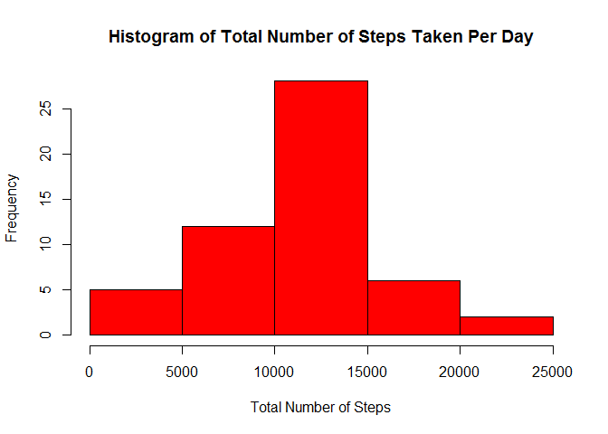
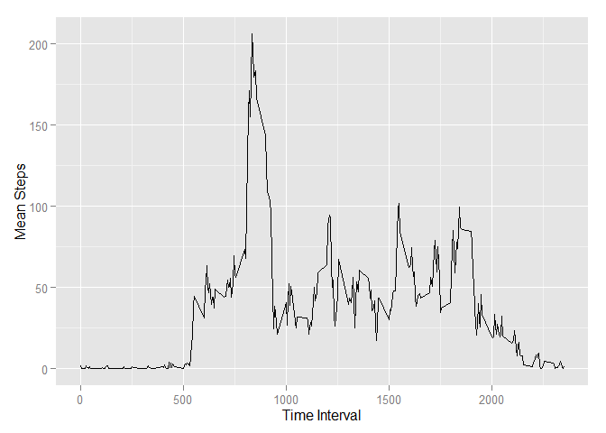
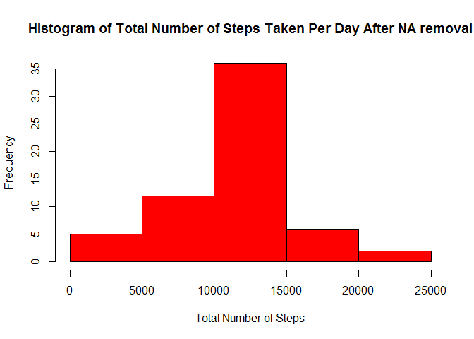
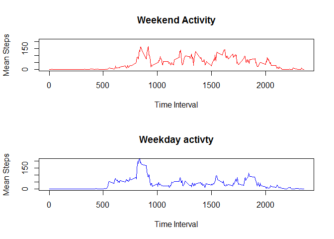

# Reproducible Research: Peer Assessment 1
This project attempts to analyze activity patterns of an anonymous user as captured by a physical devices that captured said user's activity at 5 minute intervals over a period of time. The data was acquired as a csv file.


```r
library(dplyr)
library(ggplot2)
library(lubridate)
```
### Loading and preprocessing the data
Read the csv file 


```r
rawdata <- read.csv("C:/Users/Sanjeev/RepData_PeerAssessment1/activity/activity.csv")
```

### What is mean total number of steps taken per day?
This data was collected in intervals of five minutes, over a 61 day period from
Oct 1, 2012 to Nov 30, 2012. First, we calculate the total number of steps taken per day.


```r
totsteps <- rawdata %>% group_by(date) %>% summarize(totsteps = sum(steps))
```
The following histogram displays the activity observed.


```r
hist(totsteps$totsteps,breaks = "Sturges", main = "Histogram of Total Number of Steps Taken Per Day",
     xlab="Total Number of Steps",col="Red")
```

 

The Mean and the Median of the total number of steps taken per day is 10766.19 and 10765 respectively.


```r
mean(totsteps$totsteps,na.rm=TRUE)
```

```
## [1] 10766.19
```

```r
median(totsteps$totsteps,na.rm=TRUE)
```

```
## [1] 10765
```

### What is the average daily activity pattern?
We'll summarize the mean steps after grouping those by interval. We see that there is significant activty in the morning, but very little during sleeping hours, as it should be.


```r
avgdaily <- rawdata %>% group_by(interval) %>% summarize(meansteps = mean(steps,na.rm=TRUE))
qplot(interval,meansteps,data=avgdaily,xlab = "Time Interval",ylab="Mean Steps",geom=c("line"))
```

 

#### Interval with largest number of mean steps

If we arrange the average daily mean steps in descending order, it turns out that the time interval with the largest activity is 8.35 am with an average # of steps to be 206. In fact, the top 5 highest mean step intervals are between 8.30 am and 9 am. So that half hour segment is the msot active half hour in the whole day.

```r
head(arrange(avgdaily,desc(meansteps)))
```

```
## Source: local data frame [6 x 2]
## 
##   interval meansteps
## 1      835  206.1698
## 2      840  195.9245
## 3      850  183.3962
## 4      845  179.5660
## 5      830  177.3019
## 6      820  171.1509
```

### Imputing missing values
We first calculate the number of missing values by checking how many are NA and there happen to be 2304 such values.


```r
x <- is.na(rawdata$steps)
sum(x)
```

```
## [1] 2304
```
Now, we replace the NA values by imputing the mean for that time interval


```r
newdata <- rawdata
for (i in 1:nrow(newdata)) {
  if (is.na(newdata$steps[i])) {newdata$steps[i] = avgdaily$meansteps[newdata$interval[i] == avgdaily$interval]}}
```

Now, we redraw the Histogram and it does not appear that there has been any appreciable change in the composition of the Histogram after the NA removal.


```r
newtotsteps <- newdata %>% group_by(date) %>% summarize(newtotsteps = sum(steps))
hist(newtotsteps$newtotsteps, main = "Histogram of Total Number of Steps Taken Per Day After NA removal", xlab="Total Number of Steps",col="Red")
```

 

The Mean of the total number of steps taken per day stays the same at is 10766.19 and but the median of the total number of steps has changed nominally to 10766.19, which is the same as the mean. This, presumably has happened because the NA values were replaced by the mean of steps during a specific interval.


```r
mean(newtotsteps$newtotsteps,na.rm=TRUE)
```

```
## [1] 10766.19
```

```r
median(newtotsteps$newtotsteps)
```

```
## [1] 10766.19
```

### Are there differences in activity patterns between weekdays and weekends?
To get at this, we partition the observed data between weekend and weekday. It appears that overall there is more activity during the weekends, but the peak activity level is reached during the weekday mornings.


```r
newdata$chardate <-as.character(newdata$date)
newdata$dayofweek <- weekdays(ymd(newdata$chardate))

for (i in 1:nrow(newdata)) {if (newdata$dayofweek[i] == "Saturday" | newdata$dayofweek[i] == "Sunday") {newdata$weekend[i] = "weekend"} else {newdata$weekend[i] = "weekday" }}

weekend <- newdata[(newdata$weekend == "weekend"),]
weekday <- newdata[(newdata$weekend =="weekday"),]

weekendmean <- weekend %>% group_by(interval) %>% summarize(meansteps = mean(steps))
weekdaymean <- weekday %>% group_by(interval) %>% summarize(meansteps = mean(steps))

par(mfrow=c(2,1))
with(weekendmean,plot(interval,meansteps,type="l",col="red",main="Weekend Activity", ylim=c(0,210),xlab="Time Interval",ylab="Mean Steps"))
with(weekdaymean,plot(interval,meansteps,type="l",col="blue",main="Weekday activty",ylim=c(0,210), xlab="Time Interval", ylab="Mean Steps"))
```

 
